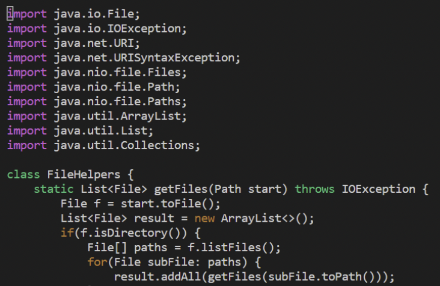
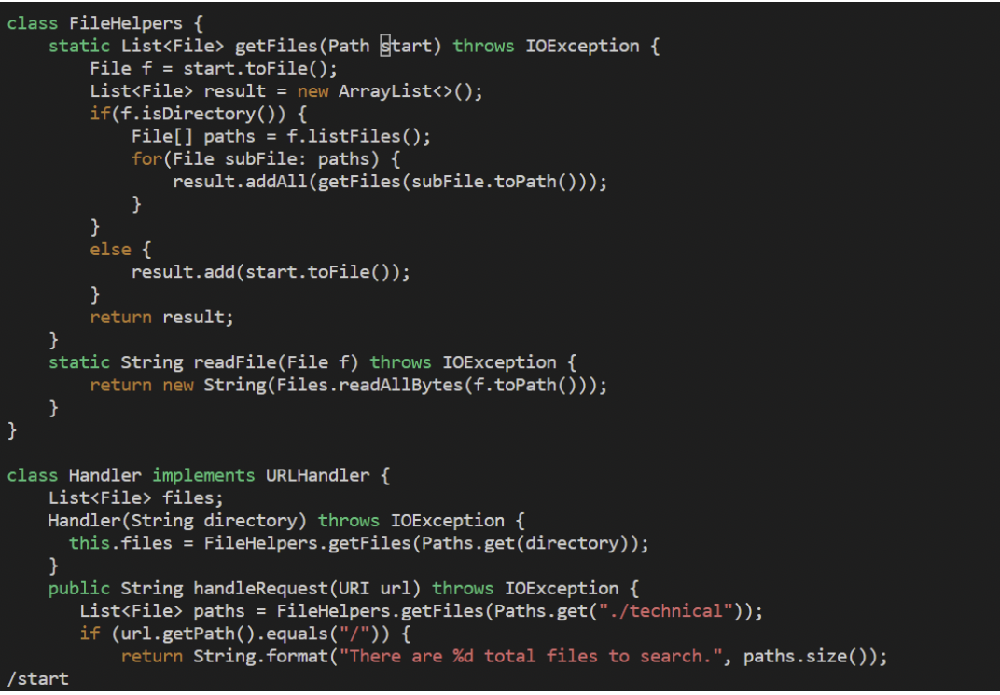
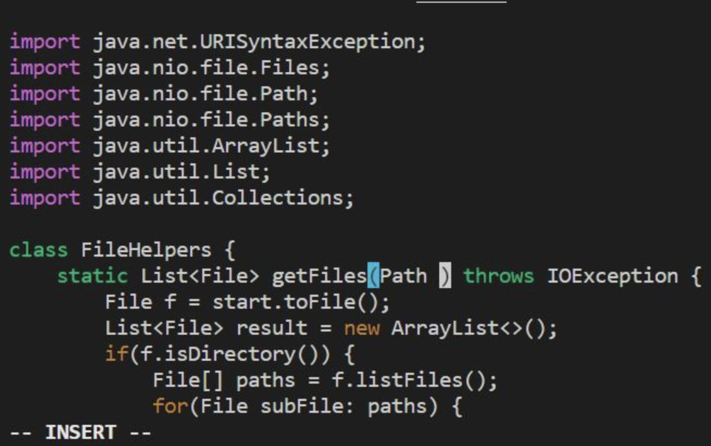
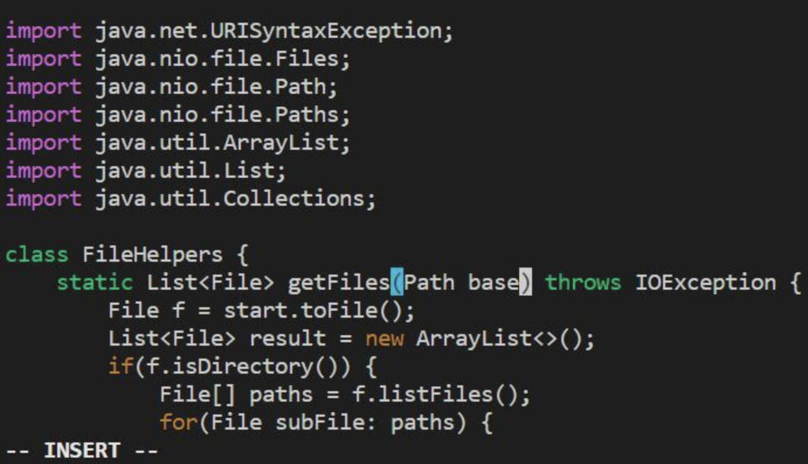
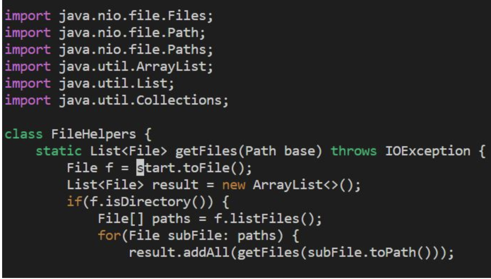
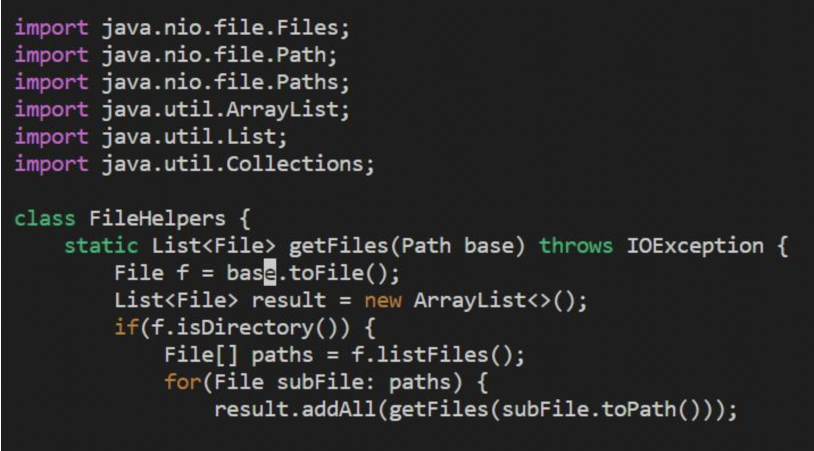
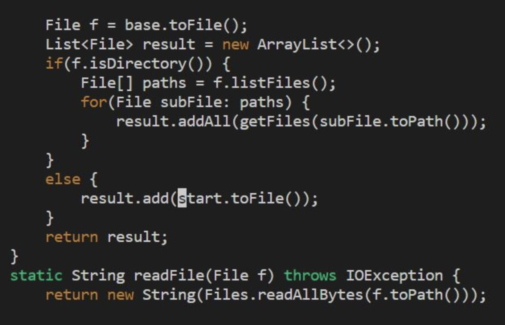
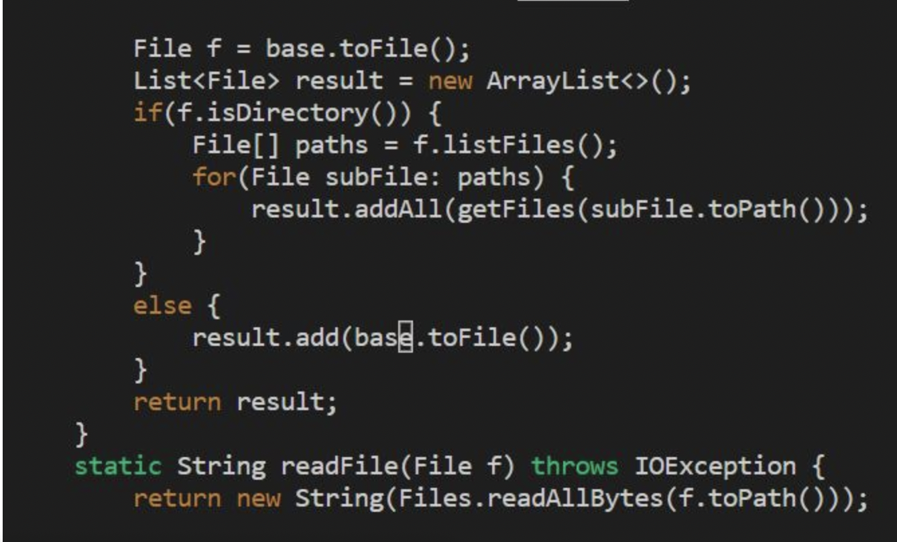
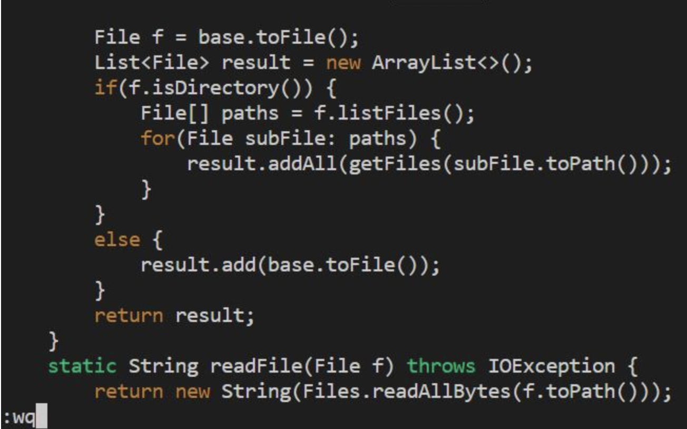

# Lab Report 4

## part 1:

In this part, the task I choose is `DocSearchServer.java`. And in this part, the task we will do is:
* Changing the name of the start parameter and its uses to base
* Adding a new line to print before File[] paths = f.listfiles()
* Changing the main method to take a command-line argument

### The whole vim sequence

1.`vim DocSearchServer.java<Enter>`
this command will let as edit the files by vim. 
`<enter>` means to run the command. 

2.Then we will use `<>` to indiczzte special keys and type in 'start' to find the variable name we need to change

3.Then we will use ` c ` and ` e `to change the command at the cursor's current location and ` e ` will help us to delete the entire paramter.  

4.After delete `start`, we nee to type in `base`, then we will us e`<esc>` to exit the editor mode and go back to normal mode. 

5.Now we need to find the next ` start ` and change it into ` base `, we can just press ` n ` to find the next ` start ` rather than repeate the whole process we have mentioned before. 

6.Now press `<.>`, which is a command that can help us repeat the step we have done to change ` start ` into ` base `

7.now we repeat the step 5 and 6 again to change the next ` start ` into ` base `. 
In this case, there are two  ` start `  left so we nee to repeat 5 and 6 twice. 

8.Now we have changed the name of one parameter, the next step is to save the change and exit so we can go to the neext step. we need to press `:wq` to let the device process what we jsut talked about, ` w ` is write the changes and ` q ` is quit. 

## Part2
In this part, we have wo tasks to finish and we will answer two questions regarding to this two task. 

### Once, start in Visual Studio Code and make the edit there, then scp the file to the remote server and run it there to confirm it works (you can just run bash test.sh on the remote to test it out). Consider having the appropriate scp command in your command history or easily copy-pasteable!

I tried several times and the average amount of time I finishi task is about five minutes. I think using VS Code to edit files is pretty fast and convenient, but copy and paste the files into remote server take me a little bit more time since I am not really familiar with the command. 

### Second, start already logged into a ssh session. Then, make the edit for the task you chose in Vim, then exit Vim and run bash test.sh.

I tried several times and the average amount of time is about four minutes. The interesting part is that I spend more than eight minutes when I did this for the first fime bu then I improved a lot. I have to say that I do not like editing files in Vim because it takes me much more time compared with editing in VS code, however, I still feels it is faster than ` scp ` becsause I can edit files directly in the server. 

### Which of these two styles would you prefer using if you had to work on a program that you were running remotely, and why?

I prefer first one, this is because I feel confident when I edit files in the VS code and more importantly, I can test the files directly in the build in terminal in VS code and there are lot of useful extensions to help me editing the code. 

### What about the project or task might factor into your decision one way or another? (If nothing would affect your decision, say so and why!

I think the most important factor for me is the amount of editing I have to do. If the only thing I need to do is to change a name of parameter for fix a small bug, I will use `Vim`, otherwise, I will choose editing on the host. 